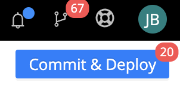

<base target="_blank">

# Demo Walkthrough

The steps below will walk you through setting up Isovalent's Tetragon agent (the open source version) and Cribl Edge to collect, transform, and route the Tetragon logs. We will enforce a standard format for Tetragon events, transform, optimize, and route events to a destination, and help you achieve ultimate observability GOAT status!

The commands below assume Ubuntu Linux 22.04 running on an ARM-based processor. Need an Ubuntu virtual machine? [Multipass](https://multipass.run/install ) from Canonical runs on Linux, Windows, and MacOS.
Starting an Ubuntu instance is as easy as  
```
multipass launch lts -n criblGOAT
```

## Step 1: Update the Ubuntu instance
The first step is to update your Ubuntu instance. Run the following command in a CLI:

If you used Multipass, use the command below to SSH to the instance `multipass shell [instance_name]`

```
sudo apt update && sudo apt upgrade -y
```

## Step 2: Install Tetragon as a Service
Use the prebuilt `install.sh` script with the commands below. You can check out the full installation instructions at the [Tetragon docs website](https://tetragon.io/docs/installation/package/)

Choose the command for AMD/x86_64 or ARM64, as appropriate.

### For AMD/x86_64
```
curl -LO https://github.com/cilium/tetragon/releases/download/v1.0.0/tetragon-v1.0.0-amd64.tar.gz
tar -xvf tetragon-v1.0.0-amd64.tar.gz
cd tetragon-v1.0.0-amd64/
sudo ./install.sh
rm -rf ../tetragon-v1.0.0-amd64.tar.gz
```

### For ARM64
```
curl -LO https://github.com/cilium/tetragon/releases/download/v1.0.0/tetragon-v1.0.0-arm64.tar.gz
tar -xvf tetragon-v1.0.0-arm64.tar.gz
cd tetragon-v1.0.0-arm64/
sudo ./install.sh
rm -rf ../tetragon-v1.0.0-arm64.tar.gz
```

## Step 3: Install Cribl Edge
To install an instance of [Cribl Edge](https://cribl.io/edge/) on your Linux server, log into your [Cribl.Cloud account](https://manage.cribl.cloud/) and follow the steps below.

**Don't have a Cribl Cloud account? [Sign up for a free account](https://cribl.io/cribl-cloud/try-cribl-cloud/) and process 1TB/day of data!**

1. Click Manage Edge.
2. From the Edge landing page, click [default_fleet](images/edge-default-fleet.png) (free accounts have one Fleet).
3. In the top-right corner, click [Add/Update Edge Node](images/edge-add-node-dropdown.png). Select [Linux > Add](images/edge-add-linux-node.png).
4. Copy the [command](images/edge-add-linux-node.png) and paste it into your Linux instance.


**NOTE**
If you are not logged in as root, you will need to add `sudo` to the command after the `|` in the `| bash -` part of the commands as in the example below.
```
curl 'https://[YOUR_INSTANCE_NAME].cribl.cloud/init/install-edge.sh?group=default_fleet&token=[YOUR_LEADER_TOKEN]&user=cribl&install_dir=%2Fopt%2Fcribl' | sudo bash -
```

### Step 4: Change the Group and Update Permissions
>NOTE
>Tetragon needs to run as `root` and the files it creates are restricted to `root:root`.
>Cribl Edge runs as a dedicated user `cribl` who belongs to the `cribl` group -- `cribl:cribl`. We need to give the `cribl` user group access to the Tetragon log file and path.

Change the group and grant permissions to the `cribl` group to read and traverse the default Tetragon log location.
```
sudo chown -R :cribl /var/log/tetragon/
sudo chmod -R 750 /var/log/tetragon/
```

## Step 5: Quick Break
Let's check our work before moving on.

- Check access to the tetragon.log file as the cribl user
```
sudo -H -u cribl bash -c 'cat /var/log/tetragon/tetragon.log'
```

- Check the status of the tetragon agent running as a service
```
sudo systemctl status tetragon
```

- Check the status of the cribl-edge agent running as a service
```
sudo systemctl status cribl-edge
```

## Step 6: Deploy Policies
With both Cribl Edge and the Tetragon agent deployed, we can deploy some policies to Tetragon to capture more than the baseline syscalls. While the intricacies of the Linux kernel, eBPF, and writing Tetragon policies are out of scope for this demo, you can follow the respective links to learn from the folks at Isovalent. If you really want to nerd out on eBPF, [Learning eBPF](https://isovalent.com/books/learning-ebpf/ ) by [Liz Rice](https://www.linkedin.com/in/lizrice/?originalSubdomain=uk), Isovalent's Chief Open Source Officer, is a fantastic read.

The policy below will attach to the kernel via a kprobe and capture tcp_connect and tcp_close calls. These calls will return details about Source and Destination addresses, TCP socket state, etc. 

Paste the following into the SSH session.
```
cat << EOF | sudo tee -a /etc/tetragon/tetragon.tp.d/tcp-sockets.yaml
apiVersion: cilium.io/v1alpha1
kind: TracingPolicy
metadata:
  name: "tcp-sockets"
spec:
  kprobes:
  - call: "tcp_connect"
    syscall: false
    args:
    - index: 0
      type: "sock"
  - call: "tcp_close"
    syscall: false
    args:
    - index: 0
      type: "sock"
EOF
```

Restart the Tetragon agent.  
```
sudo systemctl restart tetragon
```

## Step 7: Verify our work so far
After restarting the tetragon service, verify the policy worked by running the following commands.
The `sudo ... | grep` returns JSON objects containing `"function_name":"tcp_connect"` if Tetragon is working correctly.
```
wget google.com
sudo grep -i --color=always 'google.com' /var/log/tetragon/tetragon.log | grep -i --color=always 'tcp_connect'
```

## Step 8: Disable TLS Certificate Validation
**< WARNING >**  
This step disables TLS certificate validation and should only be used in a lab environment where self-signed certificates are used.

_In production environments, you should leave this enabled._

1. Navigate to [Cribl.Cloud](https://manage.cribl.cloud/) > Manage Edge
2. Select [default_fleet](images/edge-default-fleet.png) 
3. Click [Fleet Settings](images/edge-fleet-settings.png) > [Default TLS Settings](images/edge-fleet-default-tls.png) in the left nav 
4. Toggle Validate server certs switch to No
5. Click [Commit & Deploy](images/commit-and-deploy.png) in the top right 

Wait about 30 seconds, then proceed to the next step.

## Step 9: Import Configurations into Cribl.Cloud

To make the next step easy, we are going to import configurations into Cribl.Cloud. In a production environment, you would build these as part of your overall configurations.

** Do _NOT_ overwrite production configurations with these configs **

As a reminder, you need to [Commit & Deploy](images/commit-and-deploy.png) any changes you make to the configuration before you will see the results reflected in your environment.

### Import the Source configuration
1. Navigate to [Cribl.Cloud](https://manage.cribl.cloud/) > Manage Edge
2. Select [default_fleet](images/edge-default-fleet.png)
3. From the *More* menu dropdown, [select *Sources*](images/edge-sources-dropdown.png)
     - If you don't see a [`File Monitor`](images/sources-file-monitor.png) tile, toggle the view from Grid to List and click `Add Source`
     - If you see a [`File Monitor`](images/sources-file-monitor.png) tile, click the tile and then click `Add Source`
4. In the lower-left corner of the `New Source` screen, click `Manage as JSON`
5. Copy and paste the source configuration below, over-writing everything in the box
6. Click `OK` and then, on the `New Source` config, click `Save`

```
{
  "disabled": false,
  "sendToRoutes": true,
  "pqEnabled": false,
  "streamtags": [],
  "mode": "manual",
  "interval": 10,
  "filenames": [
    "*/log/*",
    "*log"
  ],
  "tailOnly": false,
  "idleTimeout": 300,
  "checkFileModTime": false,
  "forceText": false,
  "hashLen": 256,
  "staleChannelFlushMs": 10000,
  "includeUnidentifiableBinary": false,
  "id": "tetragon_linux",
  "type": "file",
  "path": "/var/log/tetragon/tetragon.log"
}
```
`Commit & Deploy` before moving on to the next section



### Import the Routes configuration
1. Navigate to [Cribl.Cloud](https://manage.cribl.cloud/) > Manage Edge
2. Select [default_fleet](images/edge-default-fleet.png)
3. From the *More* menu dropdown, select *Data Routes*
     - There should only be a `default` route. If there are other routes defined, you aren't using a test environment! 
4. Click the [`Manage as JSON`](/images/edge-routes-manage-json.png) icon to the right of the `Add Route` button
5. Copy and paste the route configuration below, over-writing everything in the box
6. Click `Save`

```
{
  "id": "default",
  "groups": {},
  "comments": [
    {
      "id": "haSJVr",
      "comment": "Route `process_kprobe` events to tetragon-network-linux pipeline",
      "index": 0
    }
  ],
  "routes": [
    {
      "id": "BLbEiH",
      "name": "tetragon-network",
      "final": true,
      "disabled": false,
      "pipeline": "pack:tetragon-linux",
      "description": "",
      "clones": [],
      "enableOutputExpression": false,
      "filter": "Object.keys(JSON.parse(_raw))[0] == ('process_kprobe')",
      "output": "devnull"
    },
    {
      "id": "default",
      "name": "default",
      "final": true,
      "disabled": false,
      "pipeline": "devnull",
      "description": "",
      "clones": [],
      "enableOutputExpression": false,
      "filter": "true",
      "output": "devnull"
    }
  ]
}
```
`Commit & Deploy` before moving on to the next section


### Import the Pack
> [Cribl Packs](https://packs.cribl.io/) allow for the easy distribution of [routes](https://docs.cribl.io/stream/routes/), [pipelines](https://docs.cribl.io/stream/pipelines/), and [knowledge objects](https://docs.cribl.io/stream/packs-standards/#knowledge-objects). In this case, our Pack targets Tetragon agent logs with all the required functions and lookups to parse and enrich the data stream.

1. Navigate to [Cribl.Cloud](https://manage.cribl.cloud/) > Manage Edge
2. Select [default_fleet](images/edge-default-fleet.png)
3. From the *More* menu dropdown, select *Packs*
4. Click the [`Add Pack`](images/packs-add-from-dispensary.png) on the right side of the screen and select `Add from Dispensary`
5. In the search box, type `tetragon` and click the tile
6. Click `Add Pack` to add the contents of the Pack to your environment

`Commit & Deploy` before moving on to the next section


### Import Destination

This demo uses a New Relic endpoint as the Destination, but you can use any endpoint that accepts logs. Make sure to name the Destination `tetragon-logs` so it matches the imported `route` configuration.

1. Navigate to [Cribl.Cloud](https://manage.cribl.cloud/) > Manage Edge
2. Select [default_fleet](images/edge-default-fleet.png)
3. From the *More* menu dropdown, select *Destinations* and then type [`New Relic` in the search box](images/edge-destinations-new-relic.png)
   - Not sending to New Relic? Search for your destination by name!
4. Click the `Logs & Metrics` and then the `Add Destination` button
5. In the lower-left corner of the `New Destination` screen, click `Manage as JSON`
6. Copy and paste the destination configuration below, over-writing everything in the box
7. Click `OK` and then, on the `New Destination` config, click `Save`
   
*Update the `apiKey` value with a New Relic Ingest key*
```
{
  "id": "tetragon-logs",
  "systemFields": [
    "cribl_pipe"
  ],
  "streamtags": [],
  "region": "US",
  "logType": "tetragon-linux",
  "concurrency": 5,
  "maxPayloadSizeKB": 1024,
  "maxPayloadEvents": 0,
  "compress": true,
  "rejectUnauthorized": true,
  "timeoutSec": 30,
  "flushPeriodSec": 1,
  "useRoundRobinDns": false,
  "failedRequestLoggingMode": "none",
  "safeHeaders": [],
  "onBackpressure": "block",
  "authType": "manual",
  "type": "newrelic",
  "apiKey": "YOUR_KEY_HERE",
  "metadata": []
}
```
`Commit & Deploy` before going to your observability platform of choice to see your Tetragon logs!


